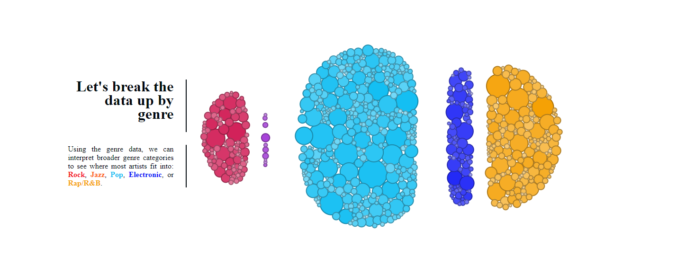
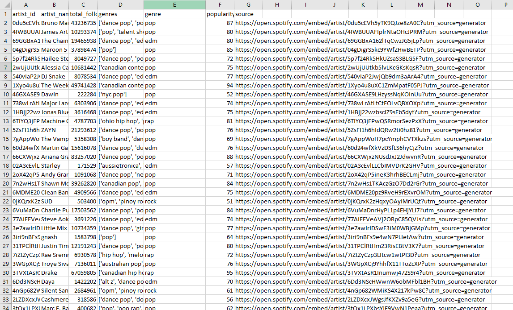
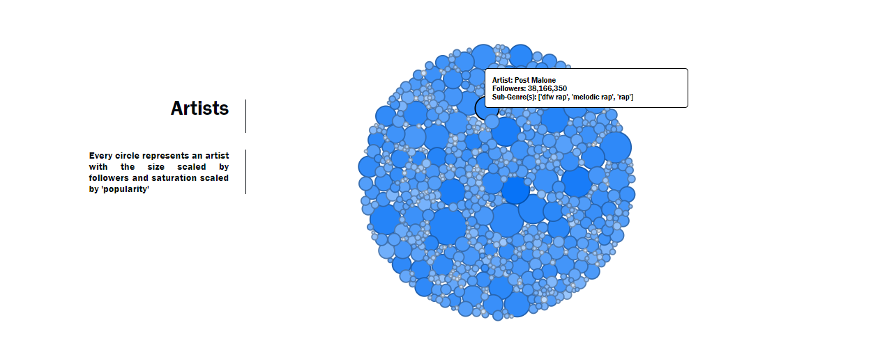
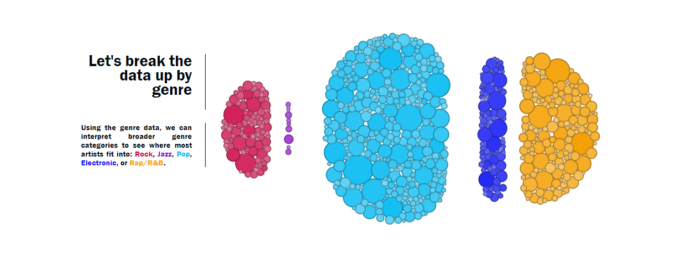
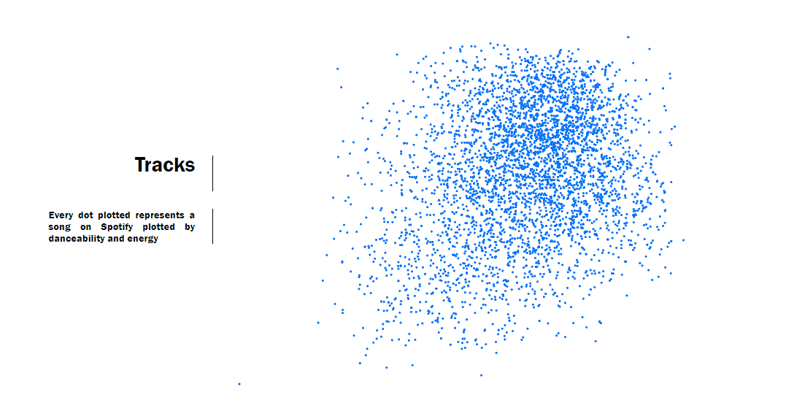
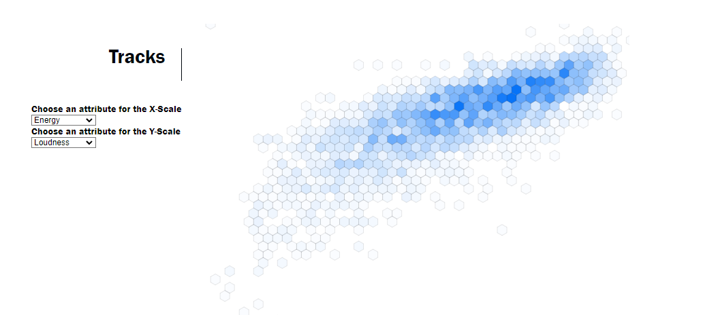

# Trends in Music Through Spotify

## Overview:
    With the help of data-driven storytelling, our team was able to present interactive visualizations, which describe music trends on the Spotify application.
    Through the help of various visualization techniques, like Heat Map, Bubble Map, Donut Chart, Scatterplot, etc., we were able to describe different trends in 
    music. 
    Through the help of different datasets our team found on Kaggle, we were able to identify the most popular songs and artists in the world and divided
    them into respective genres. We were also able to differentiate songs on the basis of their danceability and energy. 
    The team was also able to recognize different trends in accordance with the loudness, energy, acoustics, and liveness of a particular song.
    Alongside this, we also came across various interesting findings, like the astounding number of zero-rated songs on Spotify, 
    how almost every song falls under the same classic 12-tone scale, how most of the songs nowadays gravitate towards the 3-minute length, and much more.
    All of the aforementioned are documented in the project. Various measures of loudness energy, acoustics energy, duration of 
    songs, etc are also documented within the project. The user can also play a few seconds of the documented songs by using the in-build Spotify app documented inside 
    the project.
    

## Data description
    Our dataset comes from a kaggle post titled 'Popularity of Spotify Tracks by Genre'
    We primarily used the csv's that begin with 'spotify_daily_charts...'
    These contained mostly ordinal data scaled 0-1 or 0-100 for categories like energy, danceability, liveness, etc
    Another ordinal piece of the data was follower counts, which could be used to track larger artists.
    One key cardinal attribute of the dataset was genre, although Ill talk about why this needed some pre-processing.
    https://www.kaggle.com/datasets/thedevastator/popularity-of-spotify-top-tracks-by-genre
    For the the bubble chart I was using the spotify_daily_charts_artists, and the charts_test csv in the test folder is what I came up with.
    As you can see in this screen-grab I added a new genre column that is the aggregrate of the various subgenres in the pre-existing genres column.
    I did this so that I could use these aggregrated categories to attract
    I also ended up adding the source column which I found on the spotify desktop app which allowed me to create a iframe that can play the top songs of a given artist.
    To get these links I made a macro for my pc to run on a loop, looking up an artist and adding their spotify emded link to the excel, which ran for about 4 hours to get all these links.
    

    

## Goals and Tasks
    The goal of this story is to identify the most popular artists and songs as well as discover and present trends in music as observed by Spotify streams.

## Idioms
    We used a heatmap, Bubble Map, Scatterplot, donut chart, and line chart to visually represent attributes such as following, genre, and other categories
    The bubble map uses follower count to scale the size of the bubbles and popularity to scale the saturation. The bubble map animates on a scroll to separate the bubbles to different gravitational centers based on aggregate genre data.

    The scatter plot allows for songs to be plotted and scaled by various categories like energy, loudness, key, etc. The transitions are animated on scroll and on the 
    last step, a control panel is presented for user to pick the attributes for the x and y scales

    The heat map essentially takes the same data and processing from the scatterplot and aggregates the data into bins that can scale their transparency by the number 
    of entries in a given bin. The transitions are mapped to follow the scatterplot and also has a control panel on the last step for chossing x and y scales.

    The views are linked by scrollama setups, each with their own section and chart.
