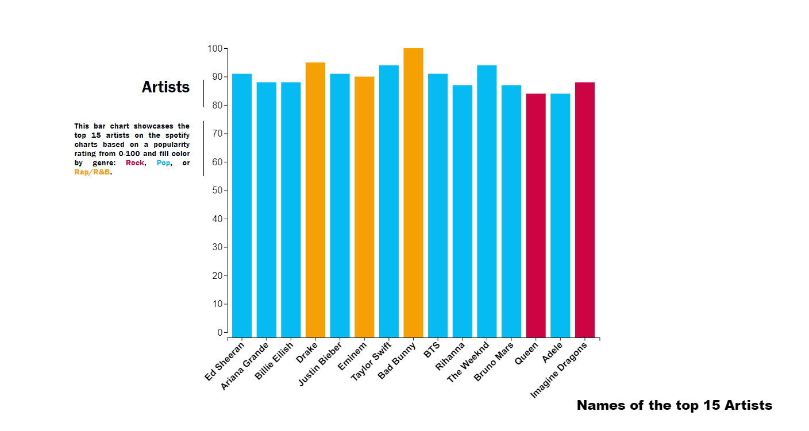

# Trends in Music Through Spotify
# Sean - Tanay - Akshaj - Vishok

## Overview:
    With the help of data-driven storytelling, our team was able to present interactive visualizations, which describe music trends on the Spotify application.
    Through the help of various visualization techniques, like Heat Map, Bubble Map, Donut Chart, Scatterplot, etc., we were able to describe different trends in 
    music. 
    Through the help of different datasets our team found on Kaggle, we were able to identify the most popular songs and artists in the world and divided
    them into respective genres. We were also able to differentiate songs on the basis of their danceability and energy. 
    The team was also able to recognize different trends in accordance with the loudness, energy, acoustics, and liveness of a particular song.
    Alongside this, we also came across various interesting findings, like the astounding number of zero-rated songs on Spotify, 
    how almost every song falls under the same classic 12-tone scale, how most of the songs nowadays gravitate towards the 3-minute length, and much more.
    All of the aforementioned are documented in the project. Various measures of loudness energy, acoustics energy, duration of 
    songs, etc are also documented within the project. The user can also play a few seconds of the documented songs by using the in-build Spotify app documented inside 
    the project.
    

## Data description
    Our dataset comes from a kaggle post titled 'Popularity of Spotify Tracks by Genre'
    We primarily used the csv's that begin with 'spotify_daily_charts...'
    These contained mostly ordinal data scaled 0-1 or 0-100 for categories like energy, danceability, liveness, etc
    Another ordinal piece of the data was follower counts, which could be used to track larger artists.
    One key cardinal attribute of the dataset was genre, although Ill talk about why this needed some pre-processing.
    https://www.kaggle.com/datasets/thedevastator/popularity-of-spotify-top-tracks-by-genre
    For the the bubble chart I was using the spotify_daily_charts_artists, and the charts_test csv in the test folder is what I came up with.
    As you can see in this screen-grab I added a new genre column that is the aggregrate of the various subgenres in the pre-existing genres column.
    I did this so that I could use these aggregrated categories to attract
    I also ended up adding the source column which I found on the spotify desktop app which allowed me to create a iframe that can play the top songs of a given artist.
    To get these links I made a macro for my pc to run on a loop, looking up an artist and adding their spotify emded link to the excel, which ran for about 4 hours to get all these links.
    

    

## Goals and Tasks
    The goal of this story is to identify the most popular artists and songs as well as discover and present trends in music as observed by Spotify streams.

## Idioms
    We used a heatmap, Bubble Map, Scatterplot, donut chart, and line chart to visually represent attributes such as following, genre, and other categories
    The bubble map uses follower count to scale the size of the bubbles and popularity to scale the saturation. The bubble map animates on a scroll to separate the bubbles to different gravitational centers based on aggregate genre data.

    The bar chart plots the largest or most popular artists on spotify and fills color by the aggregate genre used in the bubble chart

    The scatter plot allows for songs to be plotted and scaled by various categories like energy, loudness, key, etc. The transitions are animated on scroll and on the 
    last step, a control panel is presented for user to pick the attributes for the x and y scales

    The heat map essentially takes the same data and processing from the scatterplot and aggregates the data into bins that can scale their transparency by the number 
    of entries in a given bin. The transitions are mapped to follow the scatterplot and also has a control panel on the last step for chossing x and y scales.

    
    The Donut chart pretty much shows the data of how many popular artist fit in each genre. Green represents Pop, Red represents Rap/R&B, while Blue represents other genres such as rock, edm, and Jazz.

    The views are linked by scrollama setups, each with their own section and chart.
    

## Reflection
    Our initial proposal essentially started with the idea that we wanted to tell a story about music, and we found that spotify was an interesting outlet/data source 
    to do it.
    We came up with a 4 ideas for visualizations at the time of the proposal, unaware we needed 6, but nonetheless we made only 2 of those we proposed 
    Of those two, the innovative vis was made just about exactly like it was proposed.
    For the rest of the visualizations, we had to come up with designs that would support the data we had and the narrative we were telling.
    Through the WIP and final submission we each worked on our own visualizations, while Sean implemented the scrollytelling on the main page. A potential pitfall to 
    this it seems is that, to use separate charts I have six scrollama instances running each of the charts at once. This seems to make the animations drop frames on 
    slower computers. Perhaps a more efficient program could do this same task while preserving the frame rates on slower computers. 
    

## Team workload
    The team divided the workload into one or two visualization among each team member. Our main aim was to provide the user with a creative and interactive experience. 
    While Sean took most of the responsibilities of the project, each team member helped him in the best way possible. 
    The workload of each team member is as follows:
    Akshaj: Was responsible for exploring which datasets could be used for each visualization. Created a stacked bar chart that showed top 3 artists for each genre, but was unable to run it completely and add the chart to the webpage. 
    Sean: Took care of the scrolling functionalities of the webpage. Was responsible for making the heatmaps and the scatter plots in the project. Added the Spotify application at the bottom to play a few seconds of the selected track. He was also responsible for making the bubble chart.
    Tanay: Was responsible for making the bar plot describing the popularity of the top 15 artists of 2022. He was also responsible for making a line chart but due to unforeseen circumstances (influenced by Covid-19), he was unable to add the chart. 
    Vishok: He was responsible for making the donut chart and finding out the necessary datasets for the project.

## Troubleshooting / Tips
    Using named transitions can prevent multiple transitions from interrupting one another, ie. path.transition('thing1')... and path.transition('thing2)... can run at the same time

    var d = d3.select([node]).datum(); Use this to get the data object tied to any node that was created through .data().enter().append()

    If you are getting random errors when using names from the dataset you can set if (expected) else () print statements when you parse the data
